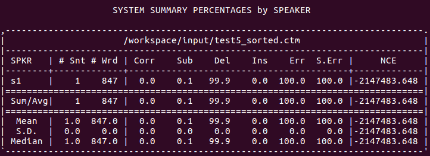

# Guidelines to install and scoring with NTU SCLITE Docker

* Prepared by: Nga (ngaht@ntu.edu.sg)
## 1. Installation
	1. Create working directory: In the terminal, type the following commands
		`$ mkdir ~/docker-sclite-scoring`
		`$ cd ~/docker-sclite-scoring`
		`$ mkdir ./scoring_input`
	2. Copy `ntu_sclite_scoring.tar` and `docker-compose_sclite-scoring.yml` into `~/docker-sclite-scoring` folder
	l. Load and run docker image
		`$ sudo docker load < ntu_sclite_scoring.tar`
	l. Check if the docker image load was successful
		`$ docker image ls`
	l. You should see something likes the below (CREATED might be different):
		`REPOSITORY                                   TAG                 IMAGE ID            CREATED             SIZE`
		`ntu_sclite_scoring                           1.0                 14442bb28483        32 minutes ago      763MB`

	l. Start the docker container
		`$ sudo docker-compose -f ./docker-compose_sclite-scoring.yml up`
	l. Check if the system has been started
		`$ sudo docker ps`
	l. You should see something likes below (CONTAINERID might be different):
		`945890a81466        ntu_sclite_scoring:1.0   "/workspace/entry_po…"   25 minutes ago      Up 25 minutes                           sclit-scoring_decoder_1`

## 2. Scoring
	l. Copy .ctm files generated by our asr engine to D:/MSF_Share/scoring_input folder
	l. Copy your edited .TextGrid files to D:/MSF_Share/scoring_input folder
	* Please note that the .ctm and TextGrid file should have the same name, for example:* 
	> `test1.ctm and test1.TextGrid`
	l. After about 5 minutes, you should see the following file extensions in your scoring_input folder: `.sys, .pra, .dtl`
	l. By opening `.sys` file, you will see a report table as below:
		
	Here, you might only need to care about the first 5 results, `Corr` for Correction Rate, `Sub` for Substitution Rate, `Del` for Deletion Rate, Ins for Insertion Rate and `Err` for overall word error rate.
	l. You also can see other detailed reports in `.pra .dtl` files

